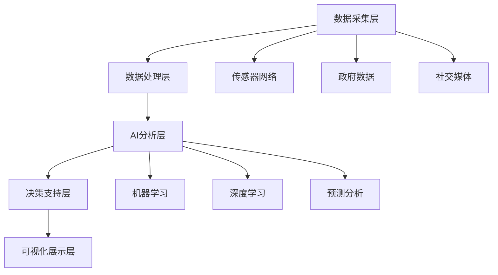

# 🏛️ 关于Urban AI

## 项目背景

随着全球城市化进程的加速，城市面临着前所未有的挑战：人口增长、交通拥堵、环境污染、资源短缺等问题日益严重。Urban AI项目应运而生，旨在运用人工智能技术为现代城市发展提供智能化解决方案。

## 核心理念

### 🎯 数据驱动的城市规划
- 利用大数据分析城市发展模式
- 基于历史数据预测未来趋势
- 优化资源配置和空间布局

### 🤖 AI赋能的智能决策
- 机器学习算法辅助政策制定
- 自动化城市管理流程
- 实时监控和预警系统

### 🌱 可持续发展导向
- 平衡经济发展与环境保护
- 促进绿色智能城市建设
- 提升居民生活质量

## 技术架构

## 应用领域

### 🚦 交通管理
- 智能交通信号控制
- 拥堵预测和路线优化
- 公共交通调度优化

### 🏠 城市规划
- 土地利用优化
- 基础设施规划
- 人口分布分析

### 🌿 环境监测
- 空气质量预测
- 噪声污染控制
- 绿地规划优化

### 🚨 安全管理
- 犯罪热点分析
- 应急响应优化
- 公共安全预警

## 团队愿景

我们致力于打造一个开放、协作的Urban AI生态系统，汇聚全球智慧，共同解决城市发展中的复杂挑战，创造更加智能、可持续、宜居的未来城市。